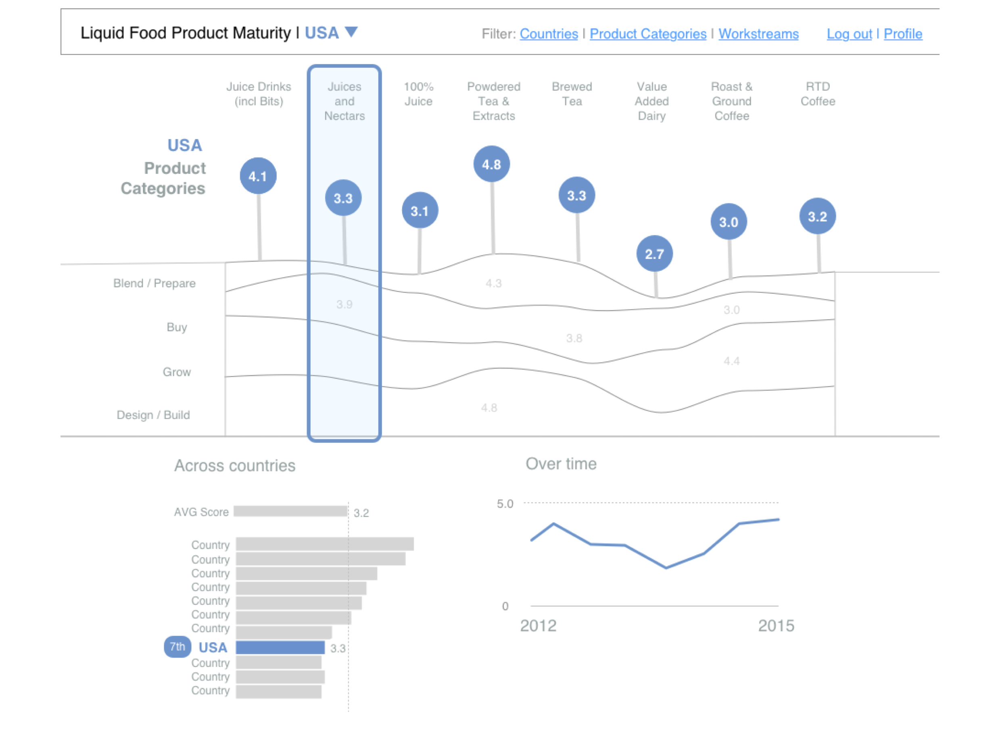
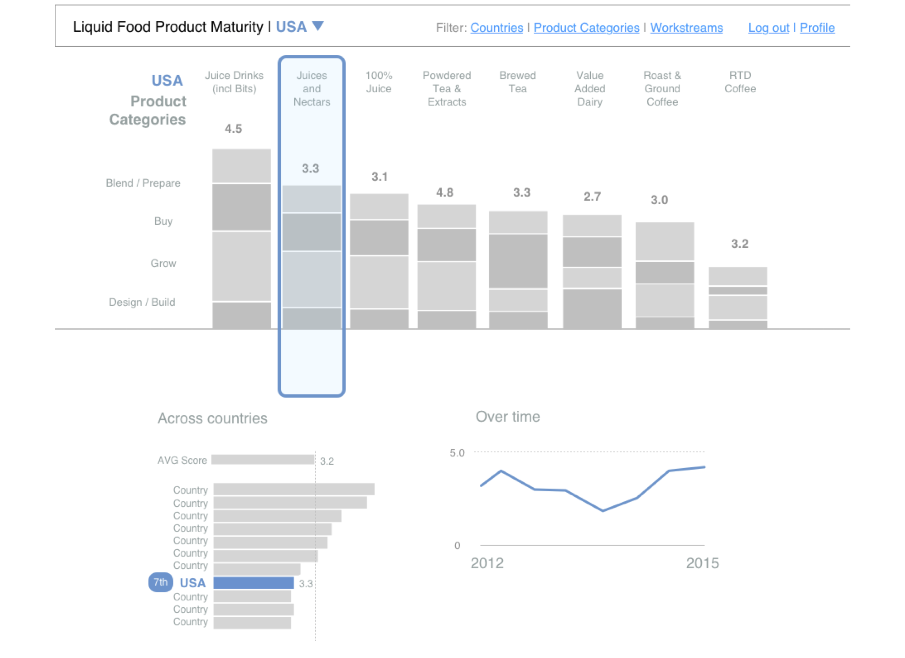
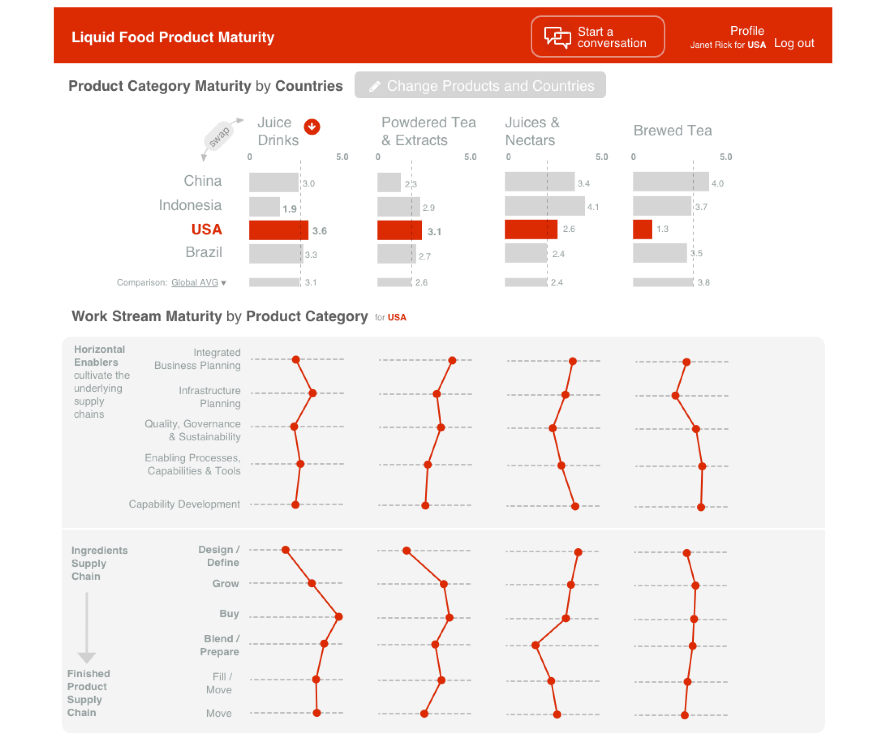
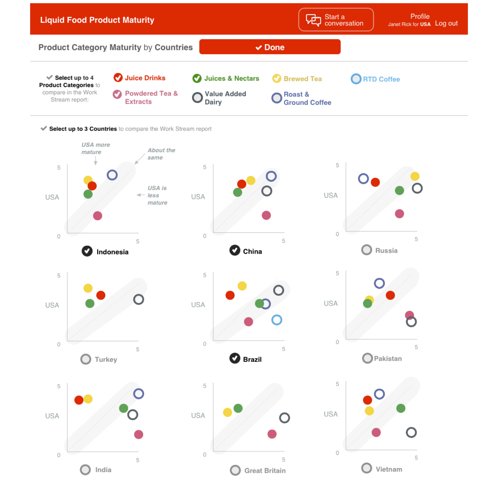

# Summary
How prepared is a country to introduce a Coca Cola liquid food product into their market? This is a tough question to answer for product leaders from so many different perspectives and cultures.

**Goal:** Measure progress on the development of Fit for Purpose Operating Models through Liquid Food product category assessments that illustrate capabilities on a maturity scale.

**Key Story:**  Differentiated LF business processes, successful practices, and experts emerge around LF maturity as visibility increases and a shared language is encouraged.

# Process

*Defining the Problem*

The project began with research and requirements gathering, via kickoff meetings and a couple follow up remote calls. After asking a thousand (?!) clarifying questions about verbiage across spreadsheets and goals conversations, I ended up with a clear enough picture to define the problem space and begin to organize the general goal areas of the report. 

The following output of this stage serves a few purposes:
- Double check that we heard everything correctly, and we're all saying the same thing
- Organize problems to solve into meaningful categories
- Present a *sample* visual example of how this maps to solving a use case

*Ideas*

After the understanding and goals were affirmed, I could move into developing concepts. I ended up with 3 concepts worth presenting to discuss the tradeoffs of each design direction with the client.

*Concept 1*

*Concept 2*

*Concept 3*

# Final Design

Comparing country performance

More info on what each rating actually means

Supporting country x product comparison

