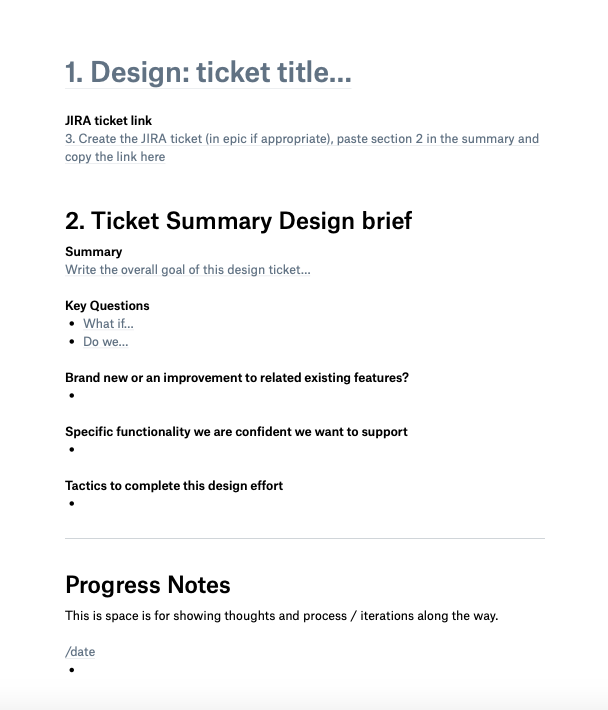

# Summary

Starting in 2018, I started making a regular practice of creating "Design Docs" for every design ticket/task. Having a consistent-yet-flexible design process is critical to repeating great design. I started creating these to fill a gap in my own process, but their format has evolved to be especially useful in working with my design team and across departments. If this approach already exists out there by another name, I'd be curious to know, but I've not come across it so far.

Just like any design process, the format isn't perfect and should evolve. I'll describe what they are for, how I use them, and why I think they're helpful for any design team. 

## The Problem

As a product designer, you can easily find yourself working across all different kinds of projects and teams at your company - big or small. Whether you have focused sprint time or longer deep dive projects, often you're working on more than one design at time. While it's fun to jump from project to project, keeping things interesting, you can also lose an incredible amount of context and decisions in all that context switching. That goes for whether you're working with team or just yourself.

We (designers) use our typical tactics to make / keep track of work:
- Design briefs
- Tickets (like in JIRA)
- Meeting notes
- Research scripts
- Emails / Slack
- [insert your to do manager]
- sketches, stickies, notes, etc
- Design files (figma, sketch, principle, etc)
- Prototypes/code

These tools are mostly great in and of themselves. But knowing what tool to pick up when can be a challenge, for new and seasoned designers. Most times we go by feel, and rightfully so, because different projects call for different tools. 

But I still had 1 big process problem, that kept gnawing at me: **the developer handoff**. 

If you have figured out the perfect developer handoff for every kind of design effort, please share it! I've yet to hear of it. What I do know that exists for this is another grab bag of tactics to achieve a great design implementation:
- Design file annotations
- Design prototypes
- Videos of prototypes/interactions
- Coded styling
- Coded prototypes
- Close developer collaboration
- Do / prototype the production code yourself
- QA, qa, qa, and qa

The design doc isn't meant to replace all these things, but to augment a few annoyances I've had with the *efficiency and transparency* aspect of these tactics that are individual islands. In general, the tactics here are fine if you have lots of time to update/reorganize all your work regularly. But it's my future self that I know gets tired (and lazy) doing all of that. 

Here's the other thing. I wouldn't have thought any of these tools were a problem if I didn't grow as a developer. When developing, you learn about all sorts of other processes that are fairly established amongst coders. 

After learning about developer habits, I started to feel unsatisfied with the parts of the design process that deal with evolving communication and design changes. I'll describe this emergence as a series of rising annoyances:

**Annoyance 1**: Developers have some great tools designers don't really have a good answer for.
- **//code comments** - A flexible bit of text that will live forever next to your finalized code. It's text, it flows, it's great. Most often used to explain why something is there or what a bit of code is doing. Our answer to this is annotations, mostly. (See Annoyance 2)
- **Git repos** - Fork, merge, push, and pull. *Easily* browse how all the code has changed, when, why, and by whom. Figma has started trying to tackle this slightly, but it's lightyears behind github usability.
- **Pull Requests** - A collaborative peer-reviewed process for their work, with a rich summary of what the feature is.

**Annoyance #2**:  Design file annotations are cumbersome and lack richness.
- When laid out on the artboard, they are cumbersome updating and can only handle text and mostly can't be long. Want to make it longer, sure that's fine, break it up and relayout everything else. 
- Want to do them in comments? That's cool. But now let's hope none of those details you spent a lot of time on don't get missed. InVision and Figma have these, but I find them disjointed from clearly presenting a design.
- They are terrible for describing non-trivial interactions. For that, we prototype which is good...but now where is that prototype...? Also, prototypes are great at *experiencing* the design. Not good for *pointing out* requirements.
- Annotations are all 1 thread. Forget about replying to specific text in a manageable way.

These annoyances found a form of a solution in this evolving design doc idea. I'll break down the pieces of it, and what I've found more or less useful for myself and the team. 

## Design doc Elements

The intention here is a flexible template with parts to be used as needed. It's also worth noting, that I used the new Dropbox Paper app to create these docs and templates. Paper uses markdown standards, so it is just enough styling to organize thoughts without tempting you to get fancy. I found that to be perfect for this process. 

The first iteration included only a version of the *Design Solution* section<a href="#aside">(1)</a> to aid in a developer requirements handoff, but I will outline all the included sections here:

**Design: ticket title** - This should be consistent with your ticketing system, in my case JIRA. Also, provide a handy link directly to the ticket. 

**Ticket Summary/Design brief** - This is where the purpose and scope of the design effort is defined. All of this should be the same info put in the ticket description.
- *Summary* 
- *Key Questions*
- *Brand new, or an improvement to related existing features?*
- *Specific functionality we are confident we want to support*
- *Tactics to complete this design effort*

**Progress Notes** - Think of this almost like the design journal<a href="#aside">(2)</a> with all your ugly thoughts and ideas you *really don't want* others to see. Still, it is great for *you* to have a place to write down thoughts and document ugly sketches of ideas you don't want to forget along the journey. **This section should be messy.** And it's ok to clean it up. But don't stress about fixing concepts here. All the finalized thoughts go in the Design Solution. 

**Design Solution**
- *Feature Summary*  - This is not a repeat of the summary from above. You've learned new things in the design process. Reflect that here.
- *Design prototype* - add a link, upload videos (3), etc.
- *Design file*
- *Design Assets/Image*
- *Components/Features*
- *Explanation of success/error states and how to handle*
- *Other Questions* - Any special considerations about future expectations.

*Template PDF*

Here are three (messy!) design docs from a variety of design tasks I've worked on for [Juicebox](/projects/juicebox). They are ordered oldest to newest, so the last one will have a format that feels closer to the current template above. I don't typically go back and clean up docs after the collaborative effort has been done to turn these into development tickets. I try to clean up and format things within reason while realtime work is happening, but after that I don't stress about it. 

**Design is done. Now what?**
After the design is done, comes the best part. Now, it is used as the primary design requirements presentation tool with developers. Once a design is scheduled to start work on, I setup a meeting with stakeholders and we walk through just the Design Solution section. Usually I will start in the doc, and then move over to design files and prototypes for understanding and initial questions. Then we'll return back to the doc to go through requirements in greater detail and add notes or to dos realtime. 

If we've done a good job, developers have everything they need to start creating their own development tickets from the requirements here. When they are done, we'll get a link to the epic tickets to scan and feel confident all the requirements have made their way into the ticket details. 

Down the road, this document can always be referred back to for context and even basic understanding on what final designs are coming. This is handy especially for other departments that want to understand the gist of final designs without you having to present over again design files. 

## Learnings & what's next

Some parts in the template are more useful ongoing than other parts, but overall I think the three main sections feel right and are used on every design effort. 

Here are some future improvements I am interested in tinkering on:
- Add a short table of contents at the top. Most people could benefit from clearly jumping to the Design Solution.
- We tend to leave the gathering of styling requirements to the figma design files, but sometimes something can fall through the cracks. Should that be covered more here or in the design files?
- The "Tactics to complete" section doesn't seem especially useful.
- Figma urls are embedded in iframes, but aren't very useful unless I was more organized with frame sizes and component layout in the figma files. This would be fun to experiment with so image files don't need to be replaced for requirements section after updating.

Finally, don't overburden your process. Do what works for you! But, if a design doc approach does help, that's great! I'd love to hear about it, and learn from you. 

<h5 id="aside">NOTES</h5>
<h5>1) Currently, I have top sections numbered purely for logistically flow. The idea is to Start an effort by starting this design doc - 1) write the title, 2) the goals, and 3) then copy and paste this info into a new ticket you create, and paste that link back to this doc.</h5>
<h5>2) In paper you can use a shortcut `/date` to stamp today's date on the page, so I use that in this section every day I want to add something. </h5>
<h5>3) Handy tip. If you use Dropbox and sync locally, copying dropbox links from the files locally and pasting them here is a quite fast way to embed video exports from your design programs.</h5>

