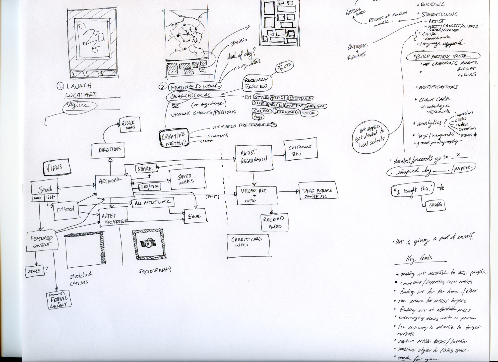
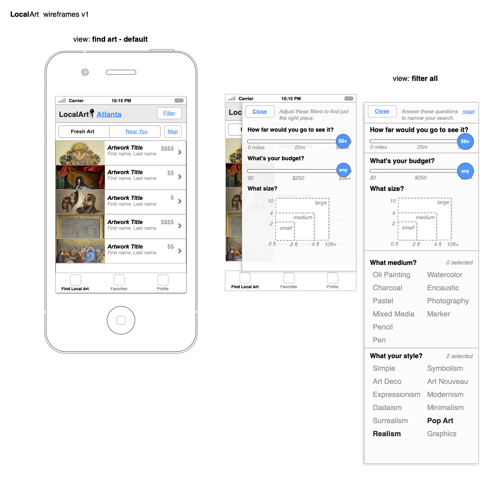
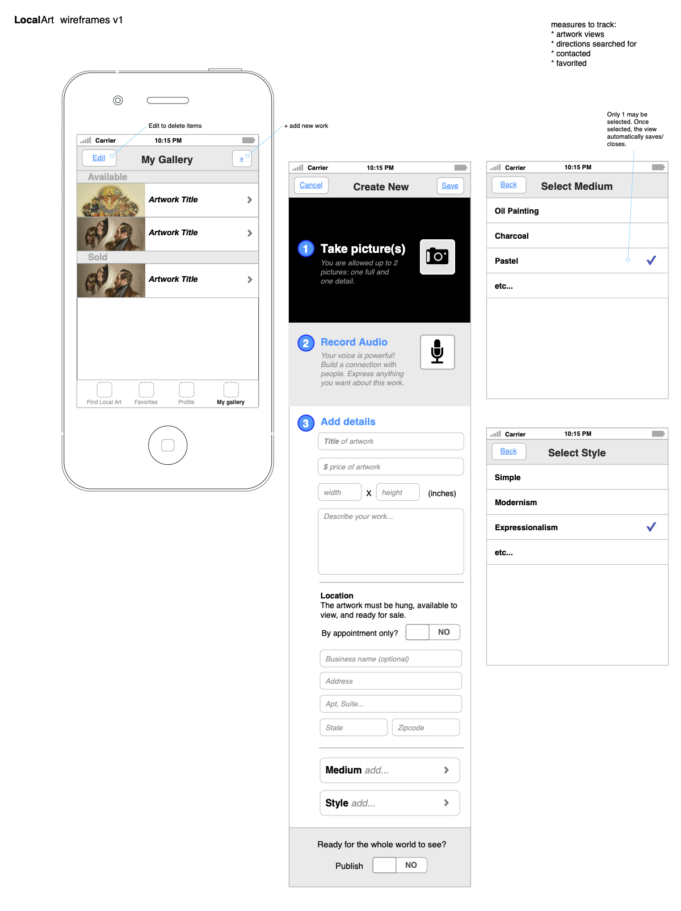
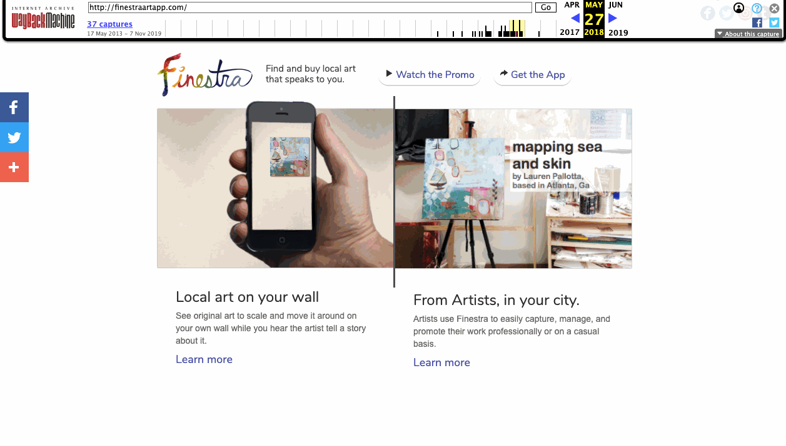

# Summary

From 2011-2017, I co-founded a startup that was one of the first fine art marketplace apps on the Apple App Store. With myself leading design and my brother leading development, we learned plenty and had a blast connecting with so many interesting artists and art lovers. While we ultimately decided to close that chapter, the lessons learned in business and design were well worth the investment.

**Goal:** Help working local artists easily make a connection between their art and local buyers.

**Key Story:**  Grow the creative confidence and inspiration of communities by enriching the relationships between artists and neighbors via artwork.

# Process

*Defining the Problem*

By 2011, I had already spent a few years casually organizing a meetup group called Atlanta Arts Movement, which was a chapter of the International Arts Movement. The motivation of this meetup was to gather as diverse artists inspiring and challenging each other to better our work. After a few years of building great relationships, I'd subconsciously been absorbing a problem that just seemed normal, and not broken, to all the artists around me: 

> ***We have lots of artwork sitting in our closets***. 

I grew up with a father that was an artist but does plumbing for a living (read the [full backstory here](https://web.archive.org/web/20141117234455/http://finestraartapp.com/story.html)). He would create incredible artwork in his spare time, but rarely did it make it out into public spaces or others' homes. This didn't really seem like a problem to me, because it was normal. 

But at the same time, I'd started to recognize this pattern of everyday people and friends communicating, "*I can't draw a stick figure*" or "*I'm not creative*". Two statements that always bounced around with odd dissonance in my head. Even though most people think creativity is only about visual art making, I knew as a designer that was far from the truth. Creativity is a muscle everyone has, but most people let it atrophy because they don't actually recognize they have it. So, they don't have the confidence to use it regularly. Or rather, when they do, they don't recognize it as creativity and then when it comes to other problems in life, they don't recognize that have a super power muscle to exercise solving problems around them. Creativity could be described as imagination set to action, and I wondered if peoples' imagination could be expanded, then perhaps their creative confidence would follow in time. 

I knew many artists, like my father, didn't necessarily have the regular skills or time to promote their artwork in ways that other people would connect with it. This is why galleries exist. They do all the heavy lifting of cultivating patrons of artists, so that artists can focus on the work. In general, this is a healthy model, however there were other factors to consider. First, around 2011, the economy was diving and galleries were closing. Only the most established physical galleries survived and many turned completely virtual. Secondly, the vast majority of people that make artwork don't do it alone as their primary income. That means they have little time or energy to devote to the management side of connecting with buyers. This seemed like gap, and an opportunity to explore. 

In summary,
- Many different kinds of people create art, that sits in storage. Most of them would prefer their artwork being out in the world appreciated by others. Managing that is time consuming, and requires administrative skills.
- Finding and buying artwork is an intimidating process for people that "aren't creative" or don't see themselves as art lovers. Everyone likes looking at art, but knowing what to buy, or even why is a challenge. 

*Ideas*

In 2011, the App Store had only been around 3 years. My designer self and engineer brother, Seth Lytle, knew this was an exciting and interesting time for digital products. Apps were the hot new thing in our world. One day I was on the way to his house, and the stewing problem and possible app solution idea bubbled to the surface. It just seemed obvious (and simple) at the time that the artist-buyer gap was a communication problem. Also, phone apps were being released to start to solving bite-sized communication problems more and more each day.

We knew we had some kind of problem-solution fit in a mobile app, and were excited to start iterating on initial concepts. 

*Some selected bits of research during those days:*

*Visual styles*

At the time the competitive market was entirely made up of websites that primarily represented either high end professional artists only, or mass produced prints. 

No one was doing anything with a local focus, on real original pieces, from real local artists<a href="#aside">(1)</a>. We knew pretty quickly, we were faced with need to create a new marketplace -- no small feat. 

We needed an easy tool for artists to capture and share their artwork, and that needed to compliment a great discovery experience for people to find artwork close to them. 

*First IA sketches*

Here is one of the first, most basic wireframes:

*And other fun diversions*

Ok, back to business. 

After translating early views into basic prototypes, we had enough to start getting feedback on the basic idea. This process was highly iterative and consisted of talking to artists as we started to design/develop the first proof of concept app. 

In retrospect, a lesson I learned here is that we should spent *considerably* more time on in-depth conversations with the other half of this marketplace marriage — the potential buyers. It wasn't that there was a shortage of excited reactions and exclamations of "that's really cool!". Everyone we talked to loved the idea, and ultimately we even got great press from various channels at launch, but I think we didn't pay enough early attention to facilitation of the art exchange experience between buyers and artists<a href="#aside">(2)</a>.

As we synthesized feedback, the wireframes rounded out with more features such as search, filtering, mapping, and innovative ways to experience the art. 

*Search*

*Filter*

*View Artwork*

We wanted our audience to experience new ways of making a connection with the art. There are two primary innovations we developed around this.
1) A viewer could **listen to the artist** deliver commentary on the art, in their own words. Even if people didn't quite connect with the visual language yet, we thought they might connect with a personal audio clip from the very artist who created it. 
2) A viewer could **see the artwork to scale on their own wall**. Art has always been hard for people to visualize in their own space. Finestra was the first mobile app to attempt doing this, before augmented reality iOS development features were available<a href="#aside">(3)</a>.

Here are initial wireframes allowing an artist to capture and upload their artwork.

*Create New*

*Photograph art and input dimensions*

*Recording the story behind the art*

Next, let's jump ahead to post-launch.

# Final Design & Marketing

If you had visited finestraartapp.com on [May 17, 2018](https://web.archive.org/web/20180527075941/http://finestraartapp.com/), courtesy of WayBack machine, it would have looked like this:

Here is the promo video I produced and edited. 

<iframe src="https://player.vimeo.com/video/61433410?byline=0" style="position:absolute;top:0;left:0;width:100%;height:100%;" frameborder="0" allow="autoplay; fullscreen" allowfullscreen></iframe>

Here are screenshots from an early version of the app.

_Gallery placeholder from legacy content._

Apart from purely design and development efforts, this adventure included all kinds of new business challenges and exciting experiences. 

Finestra used Silverpop (now IBM) as a backend CRM and communications engine. Here's Seth presenting the app at their Amplify Conference in 2014.

<iframe src="https://player.vimeo.com/video/220242993?byline=0" style="position:absolute;top:0;left:0;width:100%;height:100%;" frameborder="0" allow="autoplay; fullscreen" allowfullscreen></iframe>

## Preview App

In the years after launch, the feature that always surprised people with delight was the ability to see the artwork to scale on their wall. Eventually we decided we wanted to try making that 1 feature as simple and as shareable as possible. We decided to make another very simple iphone app that was only the art capturing process, with the ability to generate and share a web link anywhere. Then these links could be used to preview that art on any wall, all through a single webpage.

Here is an overview of how our simpler iteration **Preview** worked. I also did most of the web frontend development here.

<iframe src="https://player.vimeo.com/video/138818993?byline=0" style="position:absolute;top:0;left:0;width:100%;height:100%;" frameborder="0" allow="autoplay; fullscreen" allowfullscreen></iframe>

# Conclusions

Bootstrapping an art marketplace business was an entirely new experience for me. I was stretched beyond fixating on ux flows and interaction design, and had take responsibility for the full scope of the business. I think I particularly grew in understanding and being able to empathize with product managers, sales teams, marketing, and executives. While I hadn't run a business yet at the same scale of more successful companies, I could understand the language and the pressures more, which has continued to aid me in product design leadership roles.

<h5 id="aside">NOTES</h5>
<h5>1) As of today in 2020, sadly, there still seems to be very lackluster digital experiences to find local artwork. But I'd love to see one exist!</h5>
<h5>2) Apps today, like LetGo, have done great work in ux conversation starter patterns.</h5>
<h5>3) All the innovative dev credit here goes to the long nights of you Seth ;)</h5>

