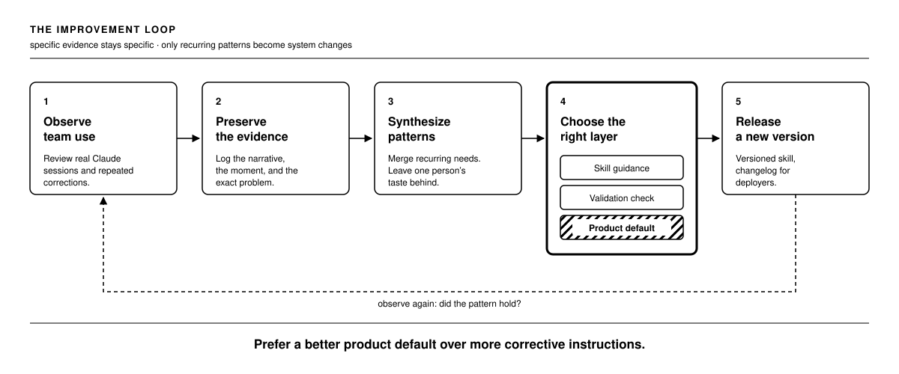

At first, every Forward narrative had to go through me. I’d make it locally, open a pull request, and wait for review, merge, and deployment before anyone could share a link. That could take days.

This was especially limiting in sales conversations. Prospects responded best when they could see a narrative built around their own use case, but I was the only person who could make one.

I designed, built, deployed, and continue to maintain a Claude Skill that lets teammates create and share narratives themselves. It guides the writing and design, then connects through MCP to our hosted platform, Dispatch, to save and share the result without a code deployment.

Our CTO leads Dispatch. We worked closely on its MCP interface and where the skill’s responsibilities should end. Other teammates now use the skill weekly for sales demonstrations and design prototypes.

# Making what I knew useful to the team

A Forward narrative brings together accurate data, story structure, visual pacing, and an interaction system that keeps growing. Before the skill, I was putting all of that together in my local workflow.

I wanted teammates to use what we’d learned about building narratives without having to learn the whole codebase. That meant giving the skill enough context to help with creative decisions while keeping the platform’s technical rules and permissions in place.

The skill guides discovery, story structure, writing, and visual conventions. It also handles stable identifiers and chooses the appropriate action for saving or updating a narrative. Dispatch owns authentication, permissions, storage, sharing, and schema validation.

The distinction matters when Claude makes a change. The skill guides the work, but Dispatch checks that the narrative follows the required structure and that the user has permission to save it.

# Working outside my local setup

Inside the Forward repository, the skill can use the full development and validation tools. The deployed standalone version works without repository access, carrying the schema, examples, design references, and icon rules with it.

With the Dispatch MCP available, Claude can save the narrative and return a shareable experience. A teammate can go from working through a story to sharing it without moving the result into a code deployment.

Editing needed some attention too. Early narratives were treated as complete files, so changing one page could mean resending the whole experience.

I introduced stable identifiers for sections and groups and connected the skill to targeted MCP actions. Claude can now update one group or section, and Dispatch checks the complete narrative again before saving. A small revision can stay small, with the rest of the work left intact.

# Learning from what people kept correcting

Once teammates were using the skill, we reviewed their Claude sessions to see what they repeatedly corrected or asked it to do differently. I started keeping those observations linked to the narratives they came from, grouping recurring issues, and tracking them until we’d addressed them.

One person’s preference doesn’t automatically become a rule. I need to work out whether a correction belongs in the skill’s guidance, in validation, or in the platform itself.

Chart widths and colors were a useful example. Teammates kept having to correct them. We made charts responsive and improved their defaults, which let the skill become simpler too. There was less to explain because the charts behaved better to begin with.

## Helping the chart say something

Another recurring issue was that a chart could show the right data without making the important comparison clear. The product already supported richer styling, but AI-authored narratives weren’t consistently using it.

I added a pattern that connects the headline to the chart: write the headline around the insight, use the same emphasis color on the relevant words and bar, and give that bar a striped treatment. Those details help the reader see which comparison matters.

Other recurring fixes became guidance for choosing appropriate photography and checking that an icon actually exists in the product’s Font Awesome kit. Each correction is small, but keeping it in the skill or fixing the default means we don’t have to keep making it in individual narratives.

# What changed

Teammates now create and revise sales demonstrations and design prototypes directly through Claude. A process that depended on me and could take multiple days is something the team can do themselves.

I don’t have a precise time-savings figure. Narrative creation and iteration are now the fastest part of the workflow, though. More of the work is in understanding the prospect, deciding what matters to their audience, and shaping the story.

# What I’m learning

Sharing the skill was the start of an ongoing process. I still need to watch how people use it, keep examples of what goes wrong, and decide where to make a change. Sometimes that means better guidance. Sometimes it means fixing a default so the instruction is no longer needed.

The useful part is giving teammates more time for the prospect and the story, with less time spent getting a narrative published.
