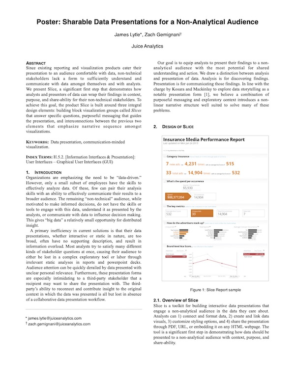

[Juicebox](https://www.juiceanalytics.com/juicebox) is the latest (5+ yr) product iteration journey towards the elusive, perfect digital platform for people to tell stories with data. In my time at Juice Analytics, this is our second, and much better, attempt to achieve this goal.<a href="#aside">(1)</a> I'll describe the product goals at a high level, and then touch on some of the unique design problems and solutions in Juicebox.

# What exactly is data storytelling?
That is what researchers and practitioners have been trying to figure out, particularly in the last 10 years. It's a multi-layered challenge in practice, as there are many ways data can be gathered, stored, and presented. In my early days at Juice, I designed an exercise primer called 30 Days to Data Storytelling<a href="#aside">(2)</a>, which spans a broad set of examples from principles.

Let me attempt to come up an answer in one sentence:

> Data storytelling is a form of communication where the context of a story is told with the presentation of data.

Not all stories or story types need data-centric views to be well told, but on the other hand, many presentations have been built that communicate data in terrible ways. As a designer, this space of designing with data has been rich with challenges and rewards. I'll break up this journey over the last 10 years into the early years (data visualization fundamentals), and the last 5 years of working on Juicebox (data & ux design).

# The Early Years 
*2010~2015 | Data visualization fundamentals*

Fundamentally, the data storytelling design problem is an information design problem. I had to learn this new material of data, and what the best ways to form it were to solve the problem of helping people explore and understand it. 

I cut my teeth in the field by following people like Edward Tufte<a href="#aside">(3)</a>, Ben Schneiderman, and Mortiz Stefaner, amongst others. At Juice there were many data vis applications from consulting contracts that I would lead the interaction and interface design on. In those days there were few well designed charting frameworks available, so this was a great time to apply principles in practice one element at time -- working out our own visual language for a data visualization application. 

Naturally, once you've done 30-40 projects from scratch, any professional can see the repeated patterns that result in successful projects. Through this process I created a big fat list of principles<a href="#aside">(4)</a> to keep in mind on any project. 

During this time we started building our first data visualization product, attempting to address a faster way to design and develop the 80% of consulting requests we would get. At this stage, we were really only starting to scratch the surface on how to think about data visualization as a product, much less a platform. Some of the key differentiating patterns we landed on are expressed in a research poster paper entitled *Sharable Data Presentations for a Non-Analytical Audience*. I wrote and presented it at IEEE Vis 2013.

Here are the highlighted design patterns that we carried through into the next product iteration:
1. **Visual building blocks** - Instead of focusing on one visualization, a data story will likely require a series of connected visuals to tell the story. At Juice we call them [Slices](projects/slices). They should share key features that create a consistent experience when moving throughout the presentation.
2. **Purposeful messaging** - It might seem obvious that data should communicate with more than directionless, bullet point labels on charts, but this is only starting to be a more established pattern. Identifying why someone should care and communicating that message clearly is imperative to capturing people's attention.
3. **Narrative flow** - This is about create a sequential direction through the data. Instead of the analytical exploratory approach, this is closer to a guided tour with *opportunities* to explore a bit along the way.

# Juicebox
*2015~Today | Data Storytelling + UX design*

As we ventured into the 2nd iteration of the platform, we built upon our past learnings and applied a better systems mindset to both design and technical goals of the product:
- **Data Storytelling + UX design:** a cohesive experience that thinks about a connected series of charts and story points that interact in richer ways. 
- **Low-code, custom development:** using modern web frameworks, Juicebox can be highly customized per client requirements. 
- **Scalable data platform:** As a containerized platform, Juicebox can scale to both the data and usage challenges of a saas product. 

In Slice we started the product with an editing UI built in, but with Juicebox we focused more on feature maturity first, starting out with the understanding that our developers would be configuring app designs for our own clients. This meant as I was designing the various UI components of the platform, I also had to consider the configuration usability for developers. While it is always easy to add more configuration options, an overly flexible system becomes more like a development language as opposed to an intentionally designed framework to more easily solve certain kinds of problems. This systemic design thinking is something I enjoyed learning more about and overseeing in the platform. 

In Juicebox, users interact with a Story which is composed of different kinds of building blocks called Slices, and these can be organized and configured in various ways to solve a particular design challenge. Each story, is generally tall, and flows from top to bottom like a webpage. Along the way, people may interact with charts of selection components to filter and focus on what they're interested in. A story is associated with a Juicebox App, and apps can have multiple complimentary stories within them that people can move navigate among. 

In Juicebox, a user interacts with a Story, which is composed of a set of Slice components that are configured to interact with each other and the user as they move through the page. 

When I worked on client projects, I would often be responsible for the design mockup. Here are 3 examples of story design mockups I created:
_Gallery placeholder from legacy content._

There are about 15 different kinds of Slice types. Some are classic visualizations like bars, trend charts, and tables while others are less traditional like a leaderboard, bubble, or key metrics hierarchy slice. All Slice types share common configuration, and each type often has its own unique configuration. 

Apps are published to a url that can be shared privately or publicly. The vast majority are private for client's customers, but here are a couple publicly available apps:

## A variety of apps built with Juicebox

## Opening Juicebox for all

We knew once we could design and fully develop diverse client projects within a couple weeks, it was clear the maturity of the platform had come a long way. At this point, we asked, "What if we could take the best parts of Juicebox and allow anyone to start building their own apps?" Over the next 2-3 years, I analyzed the most repeated design and configuration patterns across our client apps and designed an editor user experience that allows people to connect their data and start designing data stories.

This new authoring experience is a saas offering and is currently in Beta, but access may be requested from the [Juice website](https://www.juiceanalytics.com).

Here are editor screenshots on a fictitious sample app *Runners Tracker*.

*Adding a new app*

*Adjusting app settings*

*Managing data sources*

*Designing a story*
By far, one of the most challenging editing design challenges was how to architect the Slice configuration process - what would be possible and easy, and what we would cut out. After three in depth concept iterations, we landed on the final design:

*Interactions sample*

## 2022 Update Highlights

Here is an updated editor product screenshot, and some highlights of new or improved experiences that I led or managed design for:
- Removed editors tabs and integrated the new data source drawer for easy access, faster file updates, and an improved data onboarding experience.
- Option to start with report templates for best practice guidance and faster onboarding.
- Improved sharing options that provide needed flexibility for customer use cases, including embedding and public password protected apps.
- Header design options, designer and custom palettes, inline and background images
- Responsive chart layouts, and a new Filters slice with a calendar picker and numeric range selection
- A new 14 day Trial experience
- Managed access to multiple workspaces

<h5 id="aside">NOTES</h5>
<h5>1) The first attempt was a flash product called Slice. When flash died, Slice died. But here's [one old post](https://www.juiceanalytics.com/writing/slice-is-data-presentation-for-the-rest-of-us) I dug up about it.</h5>
<h5>2) Today, it's one of the Juice [getting started guides](https://www.juiceanalytics.com/white-papers-guides-and-more).</h5>
<h5>3) My first real exposure to the topic was at [a Tufte conference](https://www.edwardtufte.com/tufte/courses). He still, amazingly, runs them today.</h5>
<h5>4) [Here](https://www.juiceanalytics.com/design-principles/full-list) is the list. A handful of them have a short summary post that I collaborated on awhile back.</h5>

