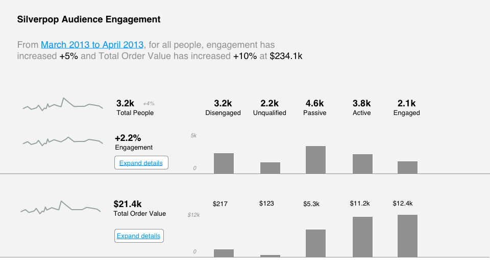
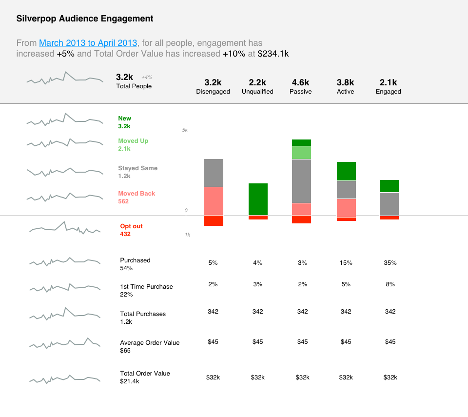
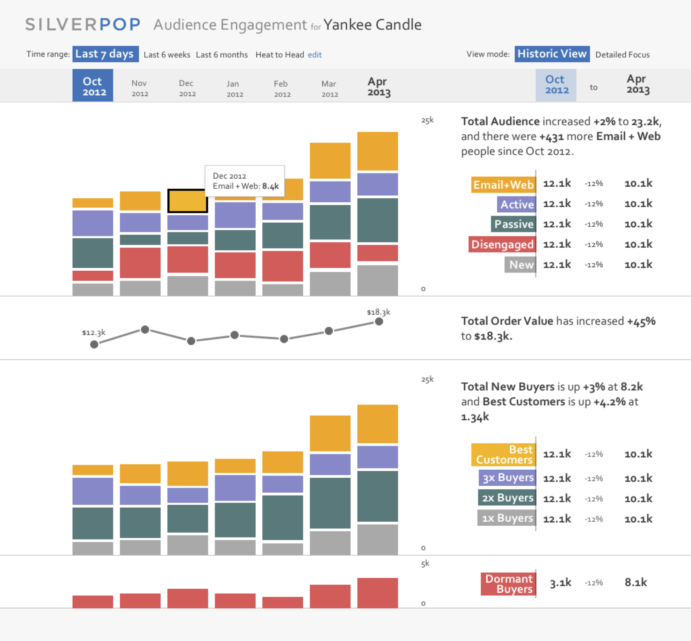
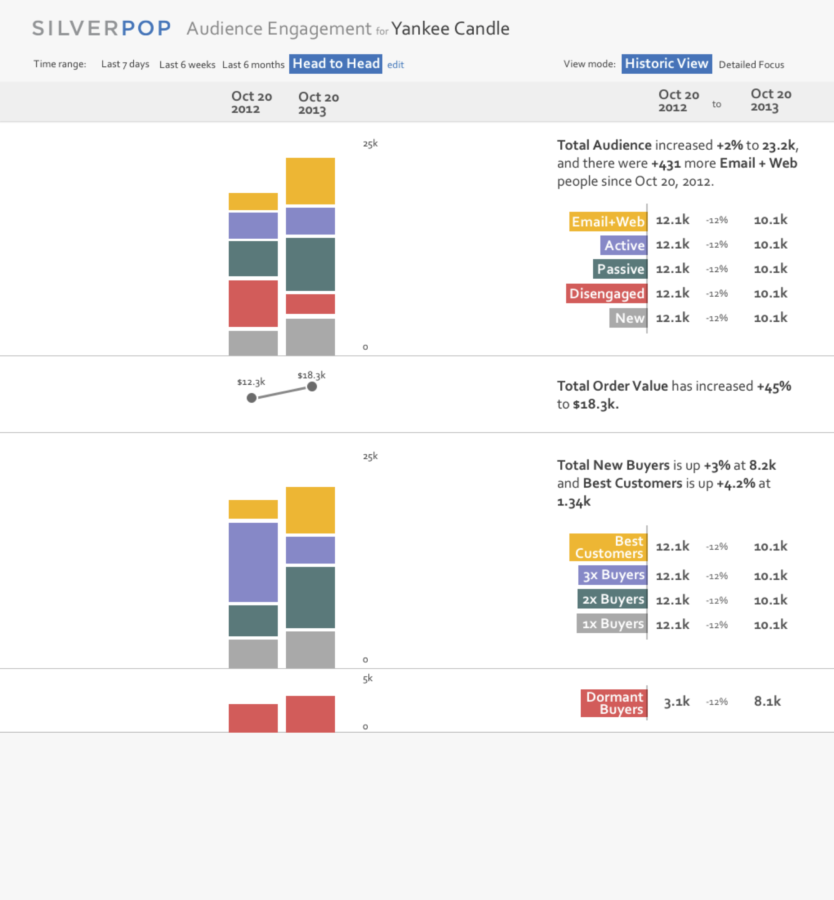

# Summary

Silverpop<a href="#aside">(1)</a> was a marketing automation company that served primarily large enterprise clients. This project was about taking them from detailed, barely used spreadsheet reports to a simple dashboard that clearly communicates customer their customer engagement scoring alongside purchasing trends. 

**Goal:** Allow customers to easily see their customer engagement trends, while also understanding how they become more or less engaged over time. 

# Process

*Defining the Problem*

When you're delivering a spreadsheet with very limited interactive and visualization capability, it is rather challenging to compare different perspectives on the data in a useful way. Silverpop's special sauce is their ability to track individual user engagement in digital activity and know whether they are becoming more or less engaged over time. If they are "Passive" or "Disengaged" you could, for example, setup a digital campaign to automatically give them offers. 

It became clear that this ability to track and communicate engagement well was being lost on their customers. They needed a clear way to breakdown these engagement trends. 

Here is an initial quick wireframe concept I created to discuss the problem space more and better understand what aspects of the data they wanted to prioritize. This concept normalized customers by their entry dates (ie. week 1, week 2, week 3 etc) in a trend of engagement scores over time. The idea here was to gauge interest in the long term trend of customer cohorts.

 After further discussion, we decided to simplify things a bit closer to the weekly/monthly trend aggregations of the reports customers had been used to. 

*Ideas*

The two key dimensions are customer engagement buckets ( Disengaged, Unqualified, Active, etc) and overall engagement trends over time. The first concept emphasized the engagement bucket totals on the right, while providing summary trending in the sparklines on the left.

Using "Expand Details" under engagement, we can now see the valuable details Silverpop is able to track: movement of customers within these engagement buckets. Here one can also investigate where most customers have decided to opt-out of further communication.

After some feedback, we decided to move in a direction that emphasizes first total engagement trend over time. Within each stacked bar, there is a breakdown of engagement buckets. 

We move the engagement movement into a secondary "Detail Focus" view. This wireframe started to hint at more interactivity like date selection.

**Final Design**

The final design brought in a few key features:
- Date range presets and customization options<a href="#aside">(2)</a>
- Summary trending stats comparing the start and end of the date range
- Ability to hover over bar segments for quick exploration.

Select a specific date range for the **Head-to-Head** comparison view.

The **Detail Focus** view breaks out of the monthly timeline view<a href="#aside">(3)</a> and instead communicates what has changed since the initial date, in this case Oct. 2012. 

The key question being answered here is indicated in the right column: *How are people moving between engagement segments since Oct 2012?*

##### NOTES
##### 1) Silverpop was bought by IBM and now operates under IBM Watson.
##### 2) Oops :( the mockup shows the "Last 7 days" preset selected, but it would actually be the last 6mos option.
##### 3) The middle month labels here were deemphasized to reenforce that the stacked bars shown don't correlate to month segments.
