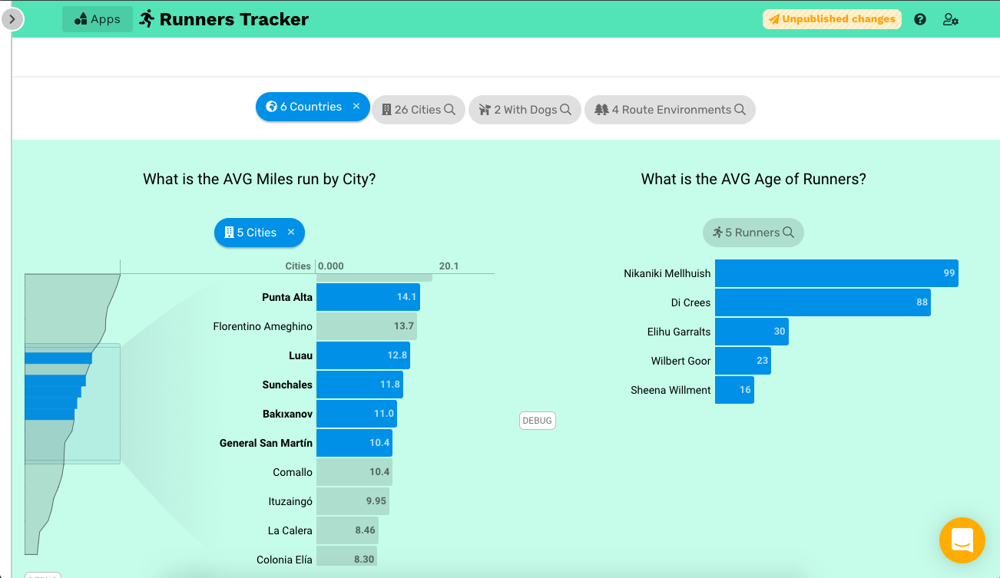

# Summary

The primary building block component of [Juicebox](/projects/Juicebox) data stories, is what we call a "Slice". They are unique set of charts and list components that have their own configuration and a specific set of common features (see [docs](https://docs.juiceboxdata.com/projects/juicebox/topics/juicebox_reference/slices/common_configuration.html)) that create the consistent user experience for both users and builders of Juicebox apps. 

For *Slices, 2.0*, I'll walk through a specific challenge our team was facing and how a solution emerged with a new version of slices.

# The Challenge

Data stories come in many kinds, but in Juicebox they are best described as a flexible linear path through data and description, in the data vis industry often referred to as the basic principle *context + focus*. This means when you are presenting data, you should allow focus on various aspects, without losing context or relationship to everything else for the user or audience. 

One of the early features in Juicebox that aided in this process is something we called **Global filters**. This component was located at the top of the story in a sticky header, and would allow you to open a panel to set the data focus you want, on any dimensions, each presented as an individual list. You could set your filters and then close this panel away, and then continue exploring the rest of the story with your set focus. 

## Problem 1: Loading, loading, loading...
Filters could be added in two ways: 1) as a designed slice that takes a bit more thought and intention around how to direct the viewer, or 2) adding another global filter. The ease of #2 led towards many global filters often being added over time via iteration requests for clients' apps. But all this adding added up to longer load times, and since the global filters was a single component *all filters* had to fully load their data before any of the story itself (the good stuff) would even appear. 

Client requests started piling up:
> *"Make Global filters load faster."*

## Problem 2: Global filters are like a clunky, expensive version of slices.

Any time we looked into speeding up global filters, there was no way getting around the need to simplify their data fetching behavior to smaller queries for each individual dimension, and this would make that functionality a bit more like slices. And then any time we looked at the additional features that global filters had that slices didn't, those looked rather interesting and related to other feature requests we had gotten for slices. 

For Juicebox, we wanted fewer, richer building blocks, and when knew investing in features around global filters were going to be costly. It would end up feeling like we are maintaining two different versions of filtering components, always out of sync in feature set, always doing almost the same thing. 

Here is one slice type example, the distribution slice. 

So why not just combine them into one component? Yes, that was an early idea, but how to do that well, in a way that wouldn't interfere with the expectations of existing key clients was a challenge. We couldn't risk losing much functionality, so we had to find a way to make it technically feasible while also improving the user experience. 

Here is a list of the main inconstancies between the two features.

| Feature        | Global filters           | Slices  |
| :------------- |:-------------| :-----|
| View data items as list only | Yes, always. | No |
| Quick list sorting | Yes, always. | No |
| Text search to find items | Yes |   Some slices |
| Place filtering inline in the story | No | Yes |
| Saved filers - save a set of selections to easily reapply in future | Yes | No |
| When switching to a complimentary story, carry over selected filters | Yes | No<a href="#aside">(1)</a> | 
| Ability to add more text description around filtering | No | Yes | 
| Error handling of individual dimensions | Barely | Yes |
| Selections preserved by the url hash | No | Yes |
| Controlled selection requirements | Yes, but old approach | Yes | 

## Problem 3: Maintain a consistent configuration experience for App developers.

It's worth pointing out that developing Juicebox apps is a configuration led process under the hood, via a series of python data services and yaml configuration files. Therefore, making the configuration process elegant, consistent, and fast is an ever present consideration when thinking about designing and developing new features for a Juicebox story. End users will never experience whatever great designs we came up with if they were bothersome for App devs to implement and maintain.

## The Opportunity, for old ideas

I'm a big believer that good ideas come back around, when the timing is right. This is why it doesn't make sense to pack every feature into what you're designing. I've learned not to force it. The time feels right when you can not only solve the immediate problem in front of you for users, but you can also give them more, delighting them with new features at nearly the same amount of effort.

Here are some reoccurring, non-urgent requests we'd had over the years, summarized in my own words.
- *"I want to point out this global filter. It's important they set it."* - The minimalist advantage of global filters would also be an issue at other times. There were often requests to link to a global filters somehow when it seemed important to set, but not so important to turn into a more visual slice chart.
- *Global filters crossfilter, but why can't slices?"* - Crossfiltering is when a filtering selection in one data set, applies those filters to a group of other data sets. This is useful so that someone doesn't spend needless time selecting filtering criteria that isn't actually valid based on other selections they've made. It's very useful, but can be rather expensive querying if you have lots of filters in that group.
- *"Sometimes, it makes the most sense to have two slices next to each other. I want to see the results more easily without the need to scroll so much."* - Juicebox, by design, is meant to be a more linear path through the data, so we intentionally didn't want a dashboard with lots of charts all on screen at once. Though there are always valid exceptions to the rule. And this was one that we knew would unlock more creative storytelling.
- "Can we get some hierarchy in the global filters? I want to group some that should selected as a set." - Some data exists as natural hierarchies. The classic example is geography: County, Region/State, Cities, etc. There was a desire to make list selection drill down for these cases.

Also, here are some other passing minor frustrations I'd been having over the years about our Slice design architecture:

- Visualizations are great, until you *simply want an easy list*. Why can't a user easily decide to view any data set as a list when they want to? Why can't search be a consistent experience across slices?
- Visually organizing your story into *meaningful sections* is often important to help with flow and understanding. We had a way of doing this, but it was tedious to configure and often wouldn't get used when it should have been. Why can't it be easier to visually group slices?
- Why can't it be *easier to select groups of data* items in slices? Whether your own saved set or a predetermined set by the app author.
- Slices are configurable components with their own sub-components. One of those is a selection pill that was often consistently hidden with extra css during development in certain slice contexts.

These two lists of things (and more I'm sure) had been rolling around on the back-burner for years, but they would eventually surface as part of the solution.

## Iterations. This is war.

Iterating through this problem felt a bit like a war. You would advance in one direction, and lose ground in another. A great element of flexibility could cause costly queries, or be difficult to configure, be too confusing to design with. How in the world are we going to backwards compatible with this change? What if we made a special *filters slice*? It's so tempting! We could configure it exactly how we wanted, but then it's just another slice that has inconsistent, unique feature support that other slices could benefit from as well. This was the recurring argument that kept it difficult to decide between two separate features or finding a way to unify them. We craved the simplicity, but finding the way was wrought with opposition.

Then the key to unifying started to emerge: **Slice pills**. 

One thing that was undeniably core to the experience of both global filters and slices is the act of viewing a set of data items, and deciding whether to select some or not. Sometimes selections should be encouraged, and other times you want to disable them entirely depending on your story design goals. 

> Slice pills are the consistent UI element we use to indicate that filtering selections are being applied to the data you are viewing. 

We started thinking - what if we could stick global filters on the page in a way where they could be small or large, depending on what you wanted. And what if they could be presented as selection pills only? 

We already had selection pills appearing in slices, but they only appeared *after* a selection was made. What if they could be there all the time, and then serve as quick access to the visualization data in list form? 

These two ideas unlocked the path towards unification, which ultimately is a rather simple idea, but the effort also needed a series of supporting new features. Those features that, as it turns out, would directly solve many of the seemingly unrelated non-urgent issues that had been lingering over the years.

The unification is best described by showing the new common yaml [config option](https://docs.juiceboxdata.com/projects/juicebox/topics/juicebox_reference/slices/common_configuration.html#display-slice-as) we introduced to all slices:

`display_slice_as: default | vis | pill`

This one config could optionally be added to any slice. Most notably the `pill` option, allowed an entire slice to be rendered only as a pill. Want to go back to showing the chart and pill? Just set it to default. Want to show the chart only in situations where the pill doesn't make sense? Use `vis`.

As expected, `default` makes sense in most situations for a normal slice. This unlocked the ability to move towards a consistent search experience across slice types. We introduced a new feature, the Side Panel list, that would render all the slice data items as a searchable, sortable list. Pinned to the left of the screen, it shows when opened, but can also automatically hide away, as not to interfere with viewing the visualization. For certain configurations this became the best of both worlds, because a user can view data as a list and hovering over list items would also highlight those items in the visualization itself -- *context + focus*.

Certain slice types have a unique data structure, such as Trends, and other hierarchical visualizations like our Bubble and Key-metrics Hierarchy slices. Since we want to provide a consistent search-select experience, we had to design ways to properly navigate and select this data in the Side Panel. Therefore, now if you wanted to show hierarchy in your global filters, you simply had to configure a hierarchical slice and set it to `pill`. Then it was easy to allow fast selection of hierarchies, sans-charts. Magical! This blew everyone's mind. 

Here is a [standalone style guide](https://www.juiceboxdata.com/new-selections/) I developed to help in implementing the final design:

Now, by setting a series of slices as `pill`, you could start to create a list of "global filters" at the top of the data story. However, since Slices so far would only stack vertically, we needed a way to layout these pills next to each other in a row. Enter the `slice_group` strategy in our yaml files. With Slice groups we could introduce a set of attributes we wanted to apply to all Slices, controlling their layout, amongst other things. 

By adding another slice with text only at the top of this group, you can achieve more emphasis and context for your filters.

The great thing about this approach, is that now you could easily add inline filters anywhere in your story. It didn't need to be at the top only. Want it half-way through, as a transitional transition between two exploratory slice groups? No problem. 

As a part of this pill redesign<a href="#aside">(2)</a>, we introduced "lazy-loading" so that the number of items only could be quickly returned from the backend without the costly loading of each data item. This is useful, especially, for applying crossfiltering, which we could now implement for a slice group. That way as one filter is set, you can get a rough idea of the amount of results returned quickly, without the need to load all the data values.

We had already implemented a way to configure backgrounds for slices, and now we could easily extend that functionality to an entire Slice group, along with some special styling options to set the group to fill the entire width of the page. This allowed for a natural way to create those meaningful sections in the story.

And finally, we can also support showing two slice visualizations next to each other. 

# Conclusion & Learnings

This design effort was rewarding because it allows us to refocus our efforts and continue investing long-term in one primary filtering component type, the Slice. We know that anytime we improve this component, it has the most impact on all our apps at once, delivering optimal value to our app devs, customers, and users. 

We unlocked new creative layout and filtering possibilities, while extending our simple yaml structure in a way easy for app devs to understand. Still as these new possibilities are explored, there are feature combinations we've had to work hard to clean some rough edges on. For example, just recently we've begun another round of work on our online editor apps to ensure various slice type combinations and settings will always look great regardless how you combine them via Story Designer<a href="#aside">(3)</a>.

While we preserved the backwards compatibility of global filters, so that clients and app owners can opt into the new ways of doing things when they are ready, we no longer had to worry about the pressure to improve the global filters feature since most of what would be asked for is solved via the new slice configuration approach. Adoption has been a bit slower than expected on old apps, but that is mostly a function of client timing with new contracts.

There are a couple features we developed as well that haven't particularly gotten much uptake. We made an opt-in slice feature to carry forward selections on to the next story in your app, and apply those filters to that slice if the dimension matches. This was introduced to specifically address that functionality from global filters, but apps with multiple related data stories seems to be the minority. We believe there is lots of possibility here, but it isn't something useful to every app. Also, in some cases, the fast loading of slice data can continue to be a bit of challenge, particularly when the data is being served up by the client's database. We had to introduce a quick fix for a couple apps that we affectionately called "laziest loading". This simply skips any query at all on these pills, so that the full story can get on with loading as fast as possible. Still, I would like us to explore further optimizations here on what slices *actually* rely on each other to load their data. 

Overall, the improvements have gone on to replace global filters in all new Juicebox apps, which has complimented a much cleaner header redesign recently completely. I very much enjoyed working on this redesign as its challenges matched its rewards.

<h5 id="aside">NOTES</h5>
<h5>1) There is separate feature I won't cover here, but it is a kind of slice that would allow some slice selections to be carried we called the *Story Chooser*. This also, had a couple iterations and at the time of this design effort it was also a bit clunky and wasn't easy to configure. </h5>
<h5>2)  Checkout [the design doc](media/pages/projects/design-docs/3139556036-1601523867/design_-new-pill-design-round-3.pdf) for part of this pill redesign iteration. </h5>
<h5>3) Juicebox has an online UI for editing app stories, called Story designer. While it doesn't give full control over yaml config, it's simplicity allows great creativity because it is so easy to try different designs.</h5>

